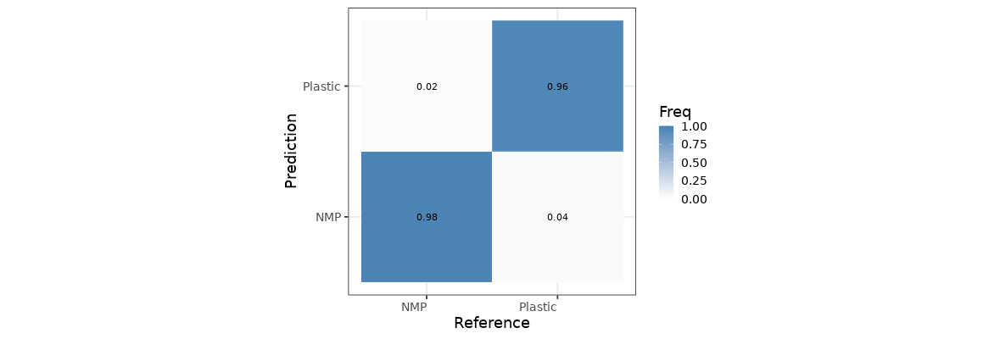
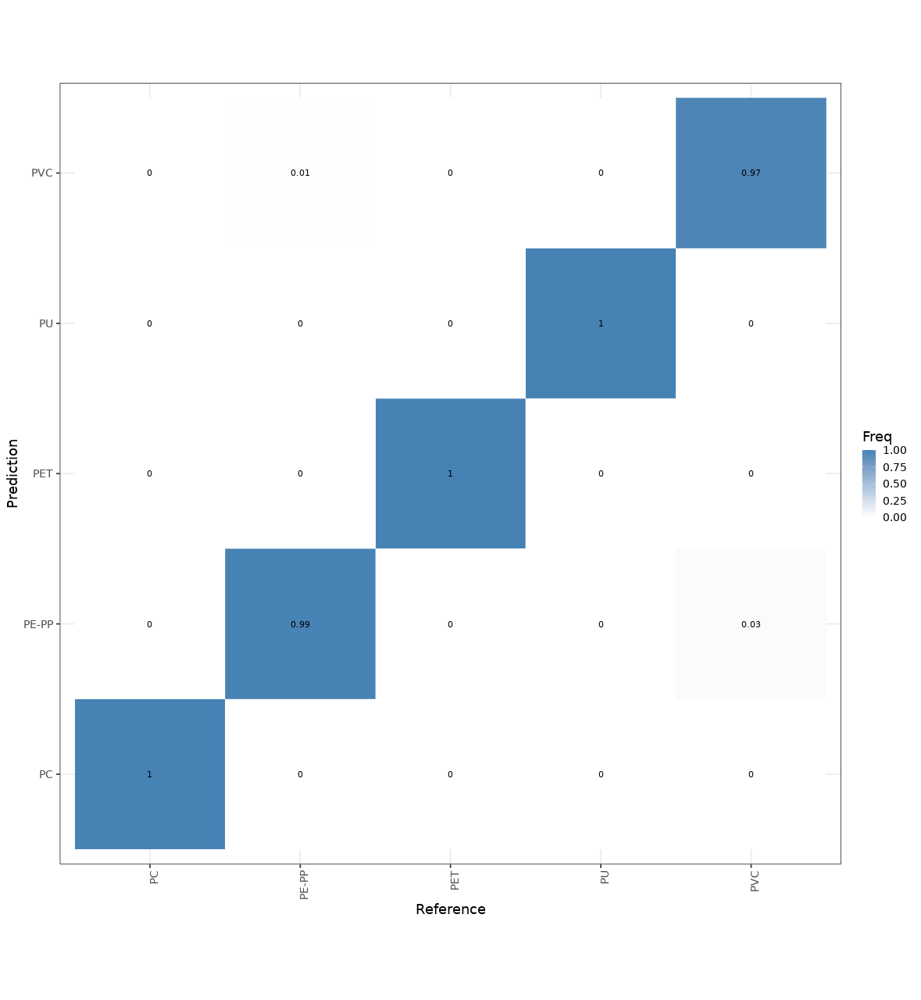
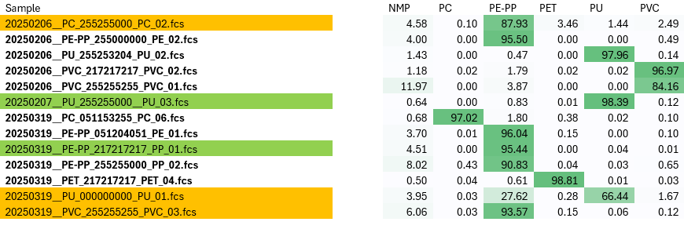
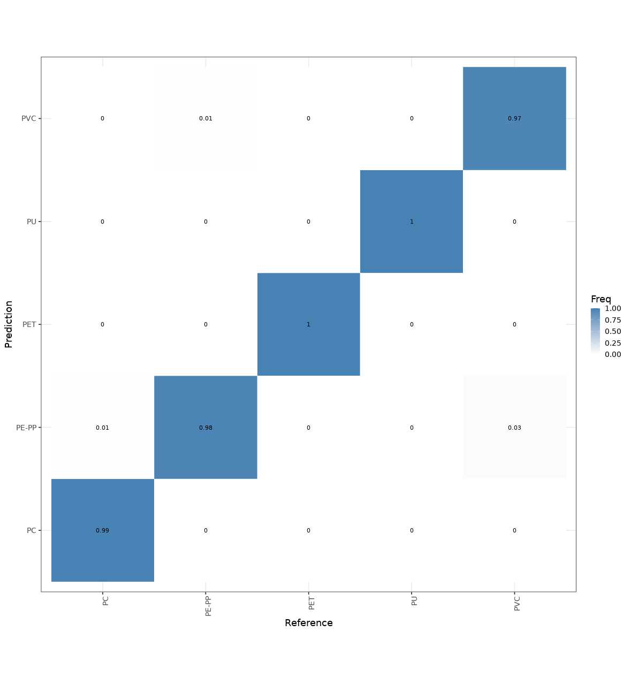
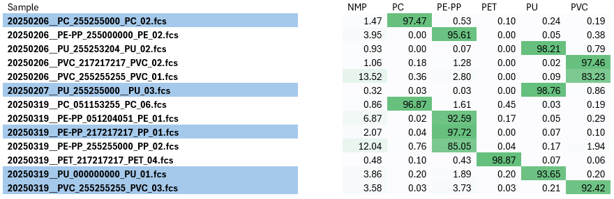

# MLA-SFC Dataset for Testing

The example dataset is in the SFC_TestSet folder from this repository.

## Minimal model trained with 8 plastic types and 6 not-microplastic types:

| MPs standards | Number of spectra |
|---|---|
| 20250206__PE-PP_255000000_PE_02.fcs | 1663 |
| 20250206__PU_255253204_PU_02.fcs | 2712 |
| 20250206__PVC_217217217_PVC_02.fcs | 4928 |
| 20250206__PVC_255255255_PVC_01.fcs | 2020 |
| 20250319__PC_051153255_PC_06.fcs | 6012 |
| 20250319__PE-PP_051204051_PE_01.fcs | 7921 |
| 20250319__PE-PP_255255000_PP_02.fcs | 10307 |
| 20250319__PET_217217217_PET_04.fcs | 6736 |
| **NMPs standards** | |
| 008MgstearateSep.fcs | 53080 |
| 009Znstearate.fcs | 53080 |
| 078Nyon.fcs | 53080 |
| NMPsRhoneRiver.fcs | 53080 |
| NMPsSSoldwater.fcs | 53080 |
| NMPsVRoldcriver.fcs | 53080 |

MP/NMP Model Stats: Confidence Score: 97.34 %

MP/NMP Normalized Confusion Matrix

MP Type Model Stats: Confidence Score: 99.11 %

MP Type Normalized Confusion Matrix

### Model trained with 8 plastic types and 6 not-microplastic types

Samples in orange and green are not included in the training dataset. The samples in orange are classified as microplastics, by the MP/NMP Multi-Layer Perceptron, however they are not classified as the correct type of microplastics by the MP type Multi-Layer Perceptron. The samples in green are classified as microplastics, by the MP/NMP Multi-Layer Perceptron, and are also classified as the correct type of microplastics by the MP type Multi-Layer Perceptron. This demonstrates the good generalization capability of the MP/NMP MLP when trained with sufficient number of spectra.

---

## Model trained with 13 plastic types and 6 not-microplastic types:

| MPs Standards | Number of spectra |
|---|---|
| 20250206__PC_255255000_PC_02.fcs | 4083 |
| 20250206__PE-PP_255000000_PE_02.fcs | 1663 |
| 20250206__PU_255253204_PU_02.fcs | 2712 |
| 20250206__PVC_217217217_PVC_02.fcs | 4083 |
| 20250206__PVC_255255255_PVC_01.fcs | 2020 |
| 20250207__PU_255255000_PU_03.fcs | 4083 |
| 20250319__PC_051153255_PC_06.fcs | 4083 |
| 20250319__PE-PP_051204051_PE_01.fcs | 4083 |
| 20250319__PE-PP_217217217_PP_01.fcs | 4083 |
| 20250319__PE-PP_255255000_PP_02.fcs | 4083 |
| 20250319__PET_217217217_PET_04.fcs | 4083 |
| 20250319__PU_000000000_PU_01.fcs | 4083 |
| 20250319__PVC_255255255_PVC_03.fcs | 3025 |
| **NMPs standards** | **53080** |
| 008MgstearateSep.fcs | 53080 |
| 009Znstearate.fcs | 53080 |
| 078Nyon.fcs | 53080 |
| NMPsRhoneRiver.fcs | 53080 |
| NMPsSSoldwater.fcs | 53080 |

MP/NMP Model Stats: Confidence Score: 98.23 %

MP/NMP Normalized Confusion Matrix

MP Type Model Stats: Confidence Score: 98.73 %

MP Type Normalized Confusion Matrix

### Model trained with 13 plastic types and 6 not-microplastic types

All plastic types are included in the dataset. Samples in blue were classified as microplastics with the previous model, however only 20250207__PU_255255000__PU_03.fcs and 20250319__PE-PP_217217217_PP_01.fcs were correctly classified in their respective plastic type (PU and PE-PP). The other three samples 20250206__PC_255255000_PC_02.fcs, 20250319__PU_000000000_PU_01.fcs, and 20250319__PVC_255255255_PVC_03.fcs are not also classified correctly according to their respective plastic type (PC, PU, and PVC).

Training models with more MPs or NMPs spectra will increase its classification accuracy.
